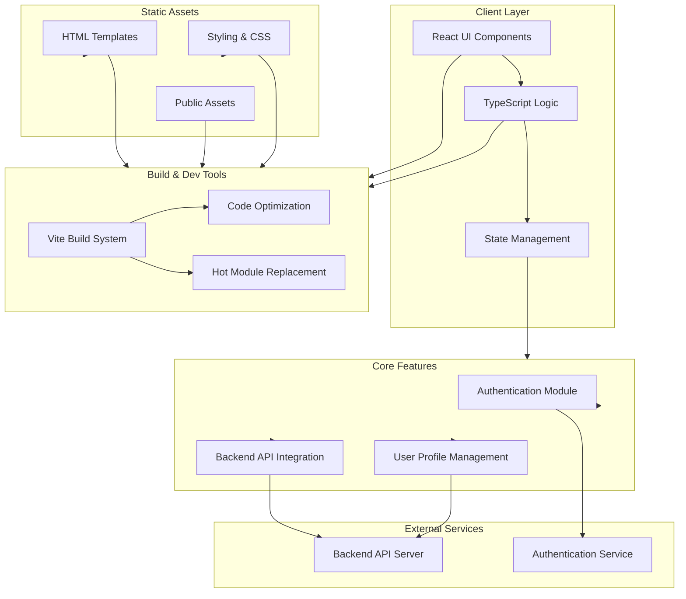
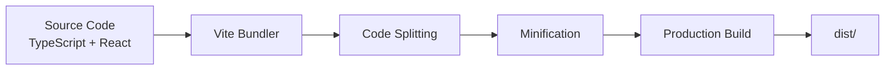

# Architecture Overview

This document provides a comprehensive overview of the Vite Starter application architecture.

## System Architecture



## Technology Stack

| Layer          | Technology                    | Purpose                   |
| -------------- | ----------------------------- | ------------------------- |
| **Language**   | TypeScript (87.7%)            | Type-safe development     |
| **Framework**  | React                         | UI component library      |
| **Build Tool** | Vite                          | Fast build and dev server |
| **Styling**    | CSS (1.3%)                    | Component styling         |
| **Markup**     | HTML (4.4%)                   | Page templates            |
| **Scripts**    | Shell (5.6%), JavaScript (1%) | Build and utility scripts |

## Project Structure

```
vite-starter/
├── src/
│   ├── components/        # React components
│   ├── pages/            # Page components
│   ├── services/         # API and service integrations
│   ├── hooks/            # Custom React hooks
│   ├── types/            # TypeScript type definitions
│   ├── utils/            # Utility functions
│   ├── App.tsx           # Root component
│   └── main.tsx          # Application entry point
├── public/               # Static assets
├── docs/                 # Documentation
├── vite.config.ts        # Vite configuration
├── tsconfig.json         # TypeScript configuration
└── package.json          # Project dependencies
```

## Key Features

### 1. **Authentication Module**

- User login and registration
- Session management
- Secure token handling
- Integration with backend authentication service

### 2. **User Profile Management**

- View user information
- Update profile data
- User preference settings
- Profile picture handling

### 3. **Backend API Integration**

- Abstracted API service layer
- Request/response handling
- Error management
- Data serialization

## Development Workflow

1. **Development Server** - Vite provides a fast HMR-enabled dev server
2. **Type Checking** - TypeScript ensures type safety during development
3. **Component Development** - React components with TypeScript
4. **Styling** - CSS with component-scoped or global styles
5. **Building** - Optimized production build via Vite

## Build Process



## Performance Optimizations

- **Code Splitting** - Lazy loading of route components
- **Tree Shaking** - Removal of unused code
- **Asset Optimization** - Image and CSS optimization
- **Development Speed** - HMR for instant feedback

## External Dependencies

- **Backend API Server** - Handles business logic and data persistence
- **Authentication Service** - Manages user authentication and authorization

---

For more details on specific components or features, refer to the relevant documentation in the `docs/` directory.
